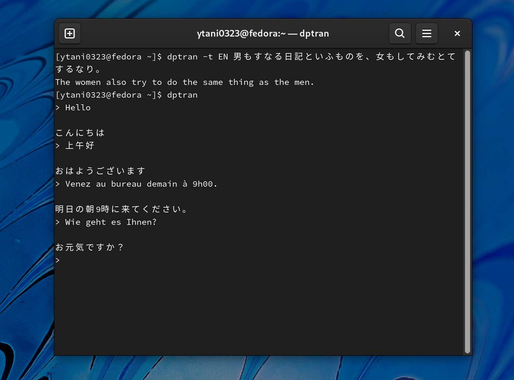

## dptran: A translator command-line tool

  
dptranは、コマンドライン上でDeepL翻訳を実行するCLIツールです。  

[TOC]

# 機能

3つのモードを搭載。用途に合わせてお選びください。

## 通常モード

コマンドライン引数に入力された文章を翻訳します。一回で一行分を翻訳できます。  
例）

```bash
$ dptran Hello
```

```bash
こんにちは
```

## 対話モード

複数回翻訳できます。複数行に渡る原文も翻訳可能です。  
例）

```bash
$ dptran
```

```
> Hello

こんにちは
> We the People of the United States, in Order to form a more perfect Union, establish Justice, insure domestic Tranquility, provide for the common defense, promote the general Welfare, and secure the Blessings of Liberty to ourselves and our Posterity, do ordain and establish this Constitution for the United States of America.

我々合衆国国民は、より完全な連邦を形成し、正義を確立し、国内秩序を維持し、共同防衛を行い、一般の福祉を増進し、我々自身と我々の子孫に自由の恵沢を確保するため、アメリカ合衆国についてこの憲法を定め、これを確定する。
> Les Représentants du Peuple Français, constitués en Assemblée nationale, considérant que l'ignorance, l'oubli ou le mépris des droits de l'homme sont les seules causes des malheurs publics et de la corruption des Gouvernements, ont résolu d'exposer, dans une Déclaration solennelle, les droits naturels, inaliénables et sacrés de l'homme, afin que cette Déclaration, constamment présente à tous les membres du corps social, leur rappelle sans cesse leurs droits et leurs devoirs ; afin que les actes du pouvoir législatif, et ceux du pouvoir exécutif pouvant être à chaque instant comparés avec le but de toute institution politique, en soient plus respectés ; afin que les réclamations des citoyens, fondées désormais sur des principes simples et incontestables, tournent toujours au maintien de la Constitution, et au bonheur de tous. En conséquence, l'Assemblée nationale reconnaît et déclare, en présence et sous les auspices de l'Être Suprême, les droits suivants de l'homme et du citoyen.

国民議会として構成されたフランス国民の代表は、人間の権利に対する無知、忘却または軽蔑が、公共の不幸および政府の腐敗の唯一の原因であることを考慮して、厳粛な宣言において、人間の自然かつ不可侵の神聖な権利を定め、この宣言が社会団体のすべての構成員に常に提示され、その権利および義務を常に思い起こさせるよう決意した。そうすれば、立法府の行為及び行政府の行為は、いつでも、いかなる政治制度の目的とも比較し得るものであるから、一層尊重され、国民の要求は、今後、簡単で明白な原則に基づいて、常に憲法の維持とすべての国民の幸福につながるであろう。従って、国民議会は、最高神の臨在の下に、人間及び市民の次の権利を承認し、宣言する。
>:q
```

``:q``で終了します。  
原文の入力完了後、2回Enterキー（Returnキー）を押さないと翻訳が実行されないことにご注意ください。

## パイプラインモード

他のコマンドの実行結果を翻訳できます。``-p``オプションを指定します。  
例えば、manページの内容を翻訳することも可能です（ただし、``$ col -b``で標準出力に一旦出力する必要あり）。  
例）

```bash
$ man ls | col -b | dptran -p
```

```bash
LS(1) 一般コマンドマニュアル LS(1)
NAME ls - ディレクトリの内容をリストアップ
SYNOPSIS ls [-@ABCFGHILOPRSTUWabcdefghiklmnopqrstuvwxy1%,] [--color=when][-D format] [file ...]］を実行します。
説明 ディレクトリ以外のタイプのファイルを指定する各オペランドに対して、ls はそのファイル名と、要求された関連情報を表示します。  ディレクトリ型のファイルを指定する各オペランドに対して、ls はそのディレクトリ内に含まれるファイルの名前と、要求された関連情報を表示します。
     オペランドを指定しない場合は、カレントディレクトリの内容を表示する。  複数のオペランドが与えられた場合、非ディレクトリのオペランドが最初に表示されます。ディレクトリと非ディレクトリのオペランドは、別々に辞書順にソートされます。
     以下のオプションが用意されています。
     -@ 拡張属性のキーとサイズをlong (-l) 出力で表示します。
     -A .および...を除く、名前がドット('.')で始まるディレクトリエントリを含めます。  Iが指定されない限り、スーパー・ユーザーに自動的に設定されます。
     -B ファイル名の印刷不可能な文字(ctype(3)と現在のロケール設定により定義される)を、 \(xxx は文字の8進数)として強制的に印刷します。  このオプションは、IEEE Std 1003.1-2008 ("POSIX.1") では定義されていません。
     -C 複数列の出力を強制する。これは、出力先がターミナルの場合のデフォルトである。
     
（後略）
```

# ご利用の際のご注意

ご利用になる場合は、DeepL APIにてAPIキーの取得が必要です。  
DeepL APIはフリープランであれば無料で利用可能ですが、月50万文字までという制限がございますのでご了承ください。  
[https://www.deepl.com/ja/docs-api/](https://www.deepl.com/ja/docs-api/){:target="_blank"}

# インストール方法

## Windows


## macOS / Linux

macOSとLinuxの場合は、導入時にビルドが必要です。  
ビルドの際、下記のライブラリが必要となります。

- libcurl-devel

```
$ git clone https://github.com/YotioSoft/dptran.git
$ cd ./dptran
$ make
$ bash ./install.sh
```

上記のコマンドを実行後、端末を再起動することでdptranコマンドが利用可能になります。

# ご利用方法

## APIキーの設定

ご利用の前に、必ずDeepL APIキー（無料で取得可能）を取得して設定するようお願いいたします。

```bash
$ dptran -s key [取得したAPIキー]
```

## 通常モードで翻訳

```bash
$ dptran Hello
こんにちは
$ dptran -t FR Hello
Bonjour
```

``-f``オプションで原文の言語を、``-t``オプションで翻訳先の言語を指定できます。翻訳先の言語の指定を省略した場合は日本語に翻訳されます。言語コードについてはヘルプをご覧ください。  

```bash
$ dptran -h
```

## 対話モードで翻訳

```bash
$ dptran
> Hello

こんにちは
> Ich stehe jeden Tag um 7 Uhr auf.

毎日7時に起きています。
> Seriously, Hiro, you need to improve your English.

マジでヒロさん、英語力アップしてください。
> 今天玩儿得真开心！

今日は素晴らしい時間を過ごせました
> :q
```

複数の原文を対話形式で翻訳できます。``:q``で終了します。

## パイプラインモードで翻訳

例）manページの内容を日本語に翻訳  

```bash
$ man ls | col -b | dptran -p
```

``-p``オプションによりパイプラインモードに切り替わります。他のコマンドの実行結果を翻訳できます。

## ヘルプを表示

```bash
$ dptran -h
```

## 翻訳可能な残り文字数を表示

```bash
$ dptran -r
Character count:		16965
Character limit (per month):	500000
```

DeepL APIで翻訳可能な残りの文字数が表示できます。DeepL APIのフリープランの場合、1ヶ月あたり50万文字まで翻訳可能です。

## デフォルトの翻訳先言語の変更

既定では日本語（JA)に設定されています。  
``-s default_lang``で変更可能です。例えば、英語（EN）に変更するには以下のようにします。

```bash
$ dptrzn -s default_lang EN
```

## 設定のリセット

全設定をリセットします。  
注：APIキーも含めてリセットされます。再びご利用の場合は、もう一度APIキーを設定するようお願いいたします。  

```bash
$ dptran -s clear
```

## アンインストール

### Windows

### macOS / Linux

```
$ bash ./uninstall.sh
```

上記のコマンドを実行後、端末を再起動することでアンインストール完了です。
